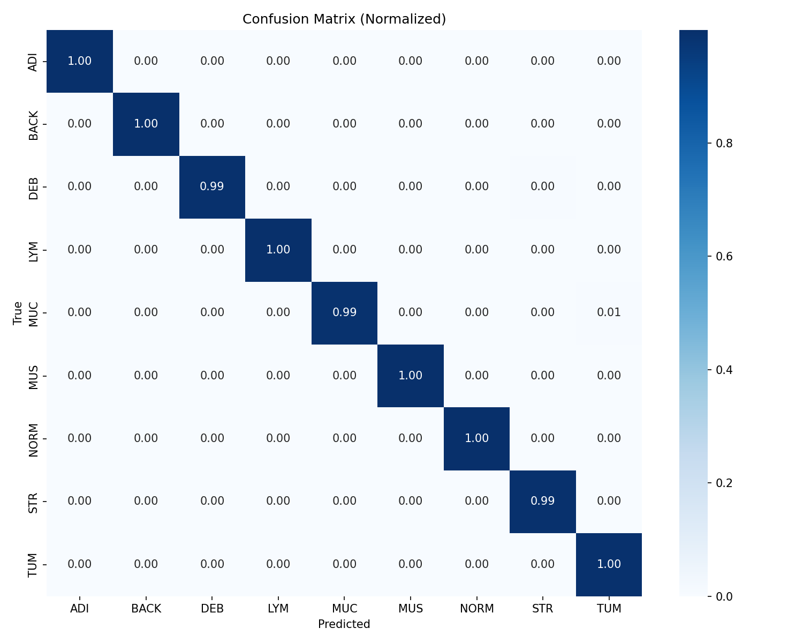

# MedVision

  

Automated histological tissue classification to support digital pathology workflows in colorectal cancer research. Accurate tissue segmentation is a prerequisite for tumor microenvironment analysis, biomarker quantification, and drug efficacy assessment in oncology.

EfficientNet-B0 (pretrained on ImageNet) fine-tuned to classify H&E-stained tissue patches into 9 classes, achieving **99.6% validation accuracy** on the NCT-CRC-HE-100K benchmark — above the published state-of-the-art range of 94–97%.

Built with PyTorch and timm.

---

## Results

Trained on 80/20 split. Early stopped at epoch 15/30.

**Validation accuracy: 99.6%**

| Class | F1 Score |
|-------|----------|
| ADI   | 1.00     |
| BACK  | 1.00     |
| DEB   | 1.00     |
| LYM   | 1.00     |
| MUC   | 0.99     |
| MUS   | 1.00     |
| NORM  | 1.00     |
| STR   | 0.99     |
| TUM   | 0.99     |



---

## Dataset

[NCT-CRC-HE-100K](https://zenodo.org/record/1214456) — 100,000 histological image patches (224×224) of human colorectal cancer tissue across 9 classes:

- **ADI** — Adipose
- **BACK** — Background
- **DEB** — Debris
- **LYM** — Lymphocytes
- **MUC** — Mucus
- **MUS** — Smooth muscle
- **NORM** — Normal colon mucosa
- **STR** — Cancer-associated stroma
- **TUM** — Colorectal adenocarcinoma epithelium

---

## Architecture

- EfficientNet-B0 backbone via [timm](https://github.com/huggingface/pytorch-image-models), pretrained on ImageNet
- Dropout (0.3) + linear classification head
- AdamW optimizer with cosine annealing LR schedule
- Mixed precision training (fp16) on CUDA
- Data augmentation via Albumentations: flips, rotations, color jitter, blur
- Early stopping with patience of 5 epochs

---

## Setup
```bash
pip install -r requirements.txt
```

Set dataset path:
```bash
export MEDVISION_DATA_DIR="/path/to/NCT-CRC-HE-100K"
```

The directory should contain class subfolders directly (`ADI/`, `BACK/`, ..., `TUM/`).

---

## Usage

Train:
```bash
python main.py
```

Evaluate — prints classification report and saves confusion matrix:
```bash
python evaluate.py
```

TensorBoard:
```bash
tensorboard --logdir runs
```

All hyperparameters are in `config.py`.

---

## Reproducibility

To reproduce the reported results:

1. Download NCT-CRC-HE-100K from [Zenodo](https://zenodo.org/record/1214456)
2. Set `MEDVISION_DATA_DIR` to the dataset root
3. Run `python main.py` — training will early stop around epoch 15
4. Run `python evaluate.py` to generate the classification report and confusion matrix

Training was run on a CUDA-enabled GPU. CPU training is supported but significantly slower.

---

## Project Structure
```
medvision/
├── config.py              # hyperparameters and paths
├── main.py                # training entry point
├── evaluate.py            # evaluation and confusion matrix
├── data/dataset.py        # augmentations and dataloaders
├── models/classifier.py   # efficientnet + classification head
├── training/trainer.py    # train/val loop, checkpointing
├── utils/metrics.py       # sklearn metrics wrappers
├── utils/visualization.py # confusion matrix and curve plots
└── results/               # saved figures
```

---

## License

MIT
